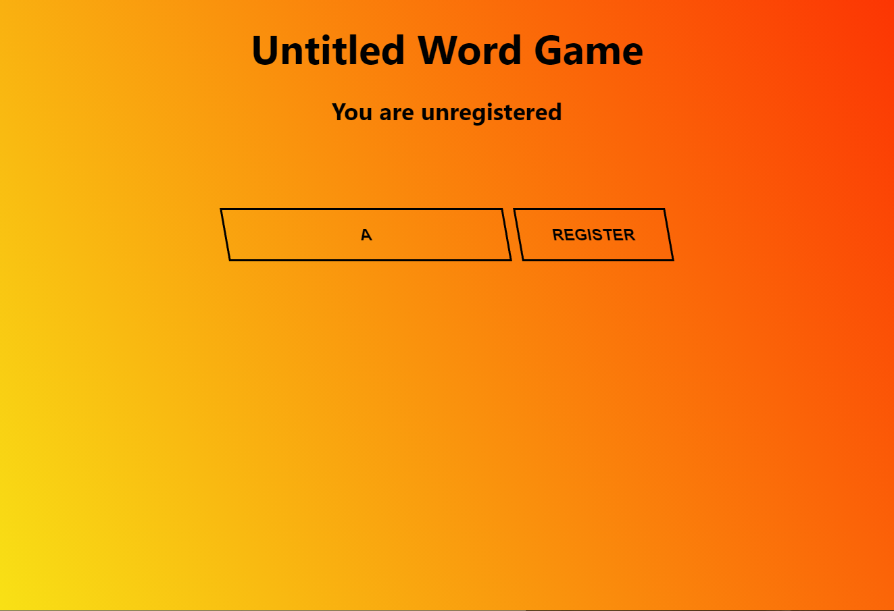

# UntitledWordGame


Word game similar to [Cards Against Humanity](https://www.cardsagainsthumanity.com/), except all answers are written by player. Built in go and svelte to try them out in something more complex. Uses websockets to communicate, stores almost no data on the server.

## Building
- Build the frontend
  1. In the frontend directory run `npm i` then `npm run build`, you will end up with a frontend build in the public directory.
  2. Copy the contents of public directory to `cmd/fgame/web/`
- Build the game
  1. Provide your own questions in `./internal/server/data.txt`
  2. In the root directory run `go build ./cmd/fgame/`.

## Server flags
```
  -addr string
        http service address (default "localhost:8080")
  -maxPlayers int
        maximum number of players in room (default 10)
  -maxScore int
        maximum score for player (default 10)
  -timeoutMultiplier int
        timeout multiplier for debugging (default 1)
```